# First Portfolio website


My first portfolio inside the "JovDev" website, made with:
- HTML5
- CSS3
- JavaScript
- jQuery 3
- Bootstrap 5

---


"Out of order" home, dark-mode home and "404 error" page (at https://jovdev.com)
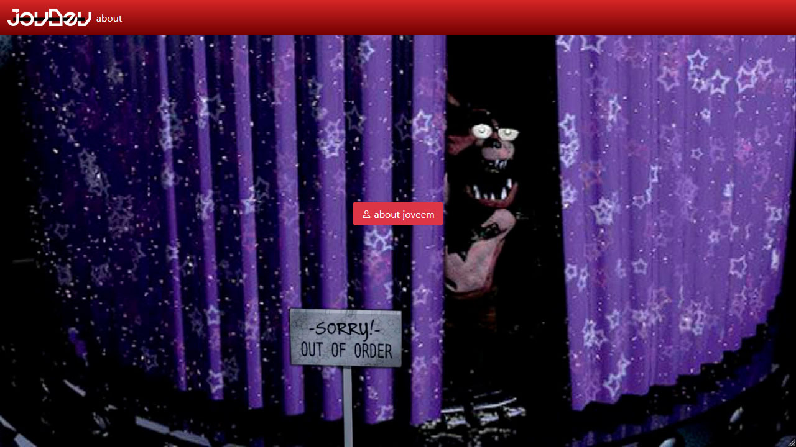
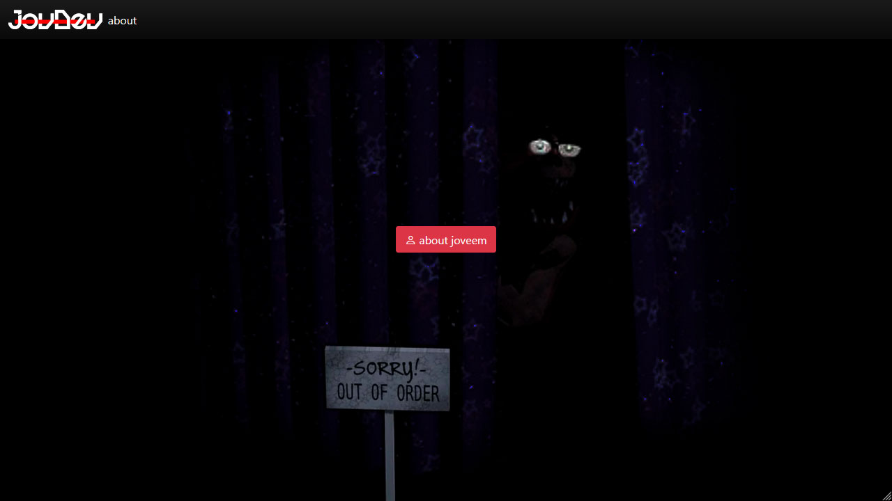
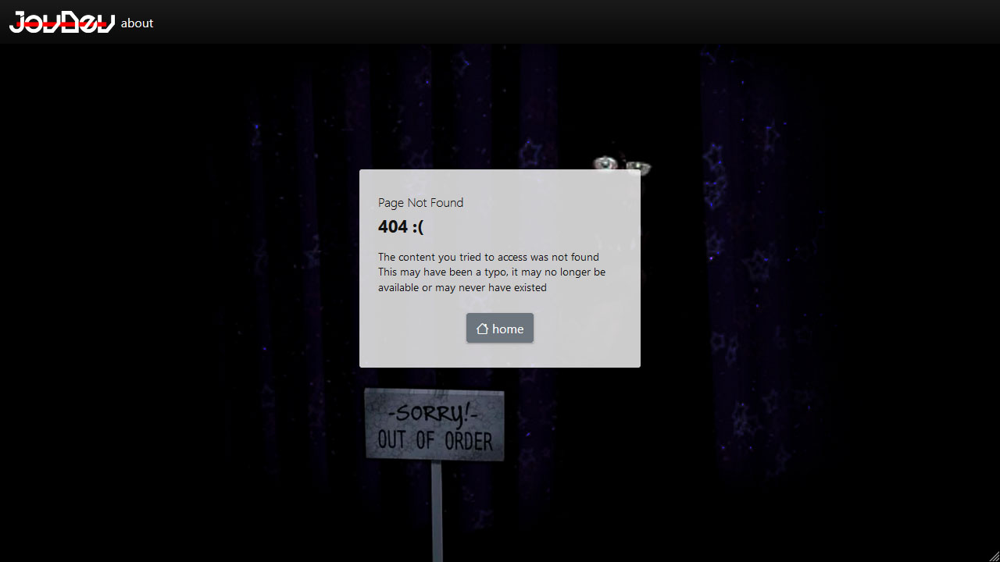

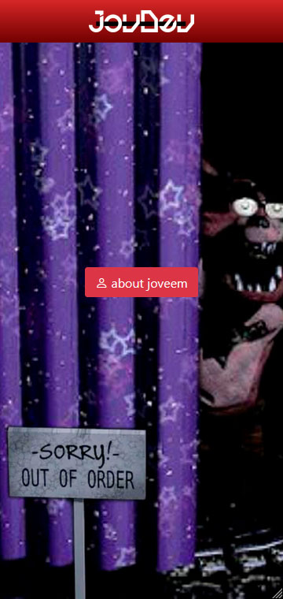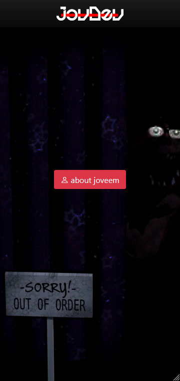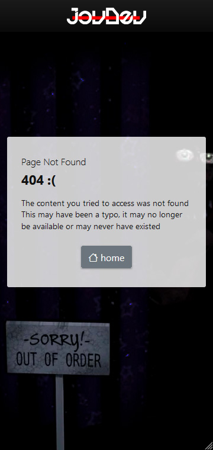

"About Joveem" page (at https://jovdev.com/about/joveem)

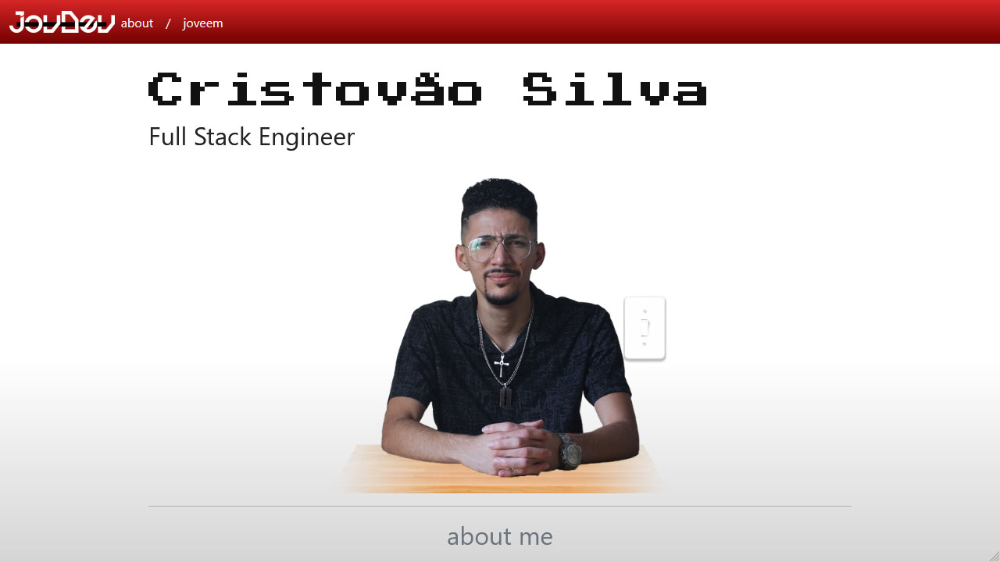
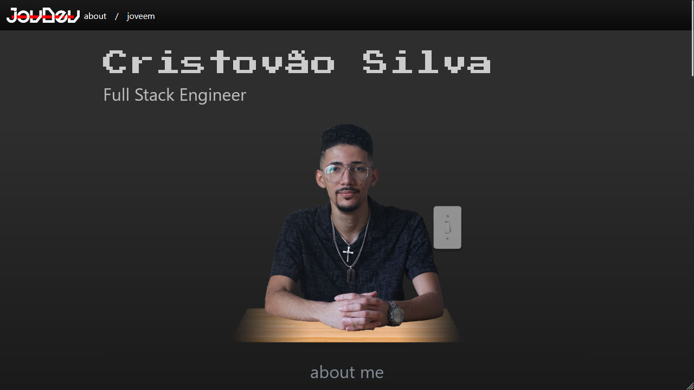
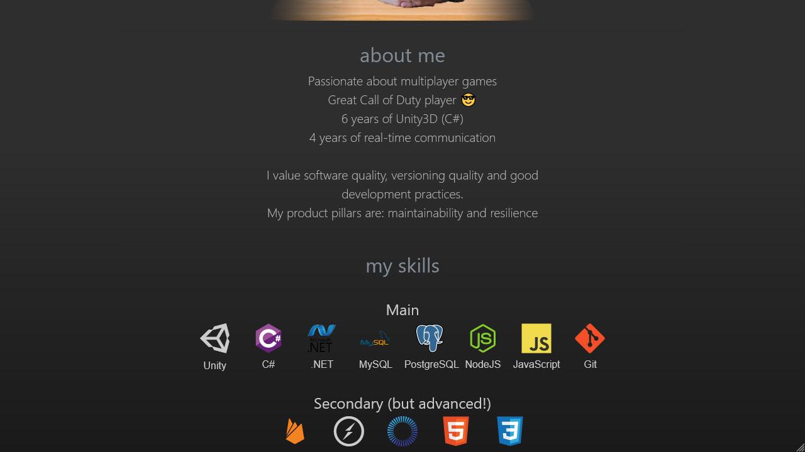
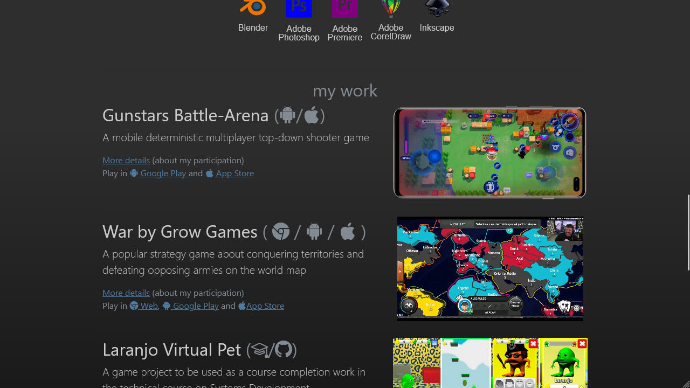

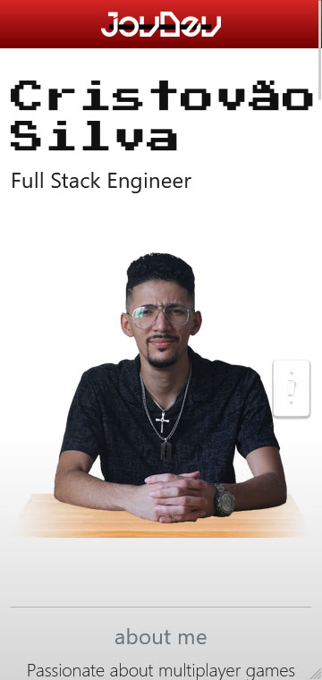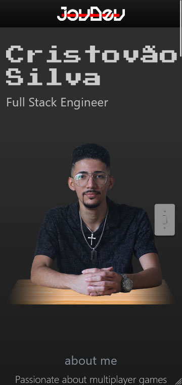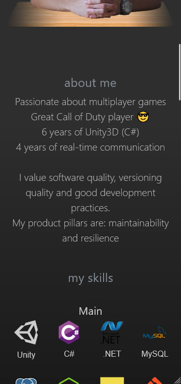
<br>


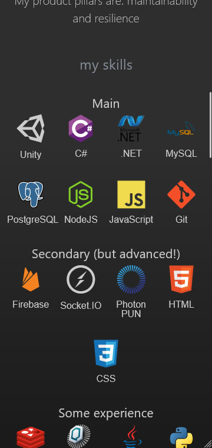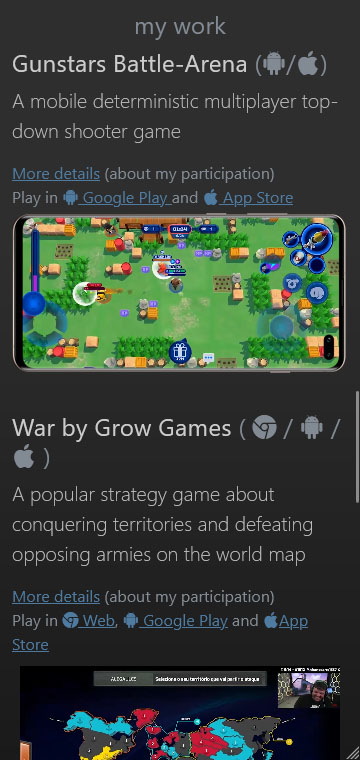


"Participation details" page

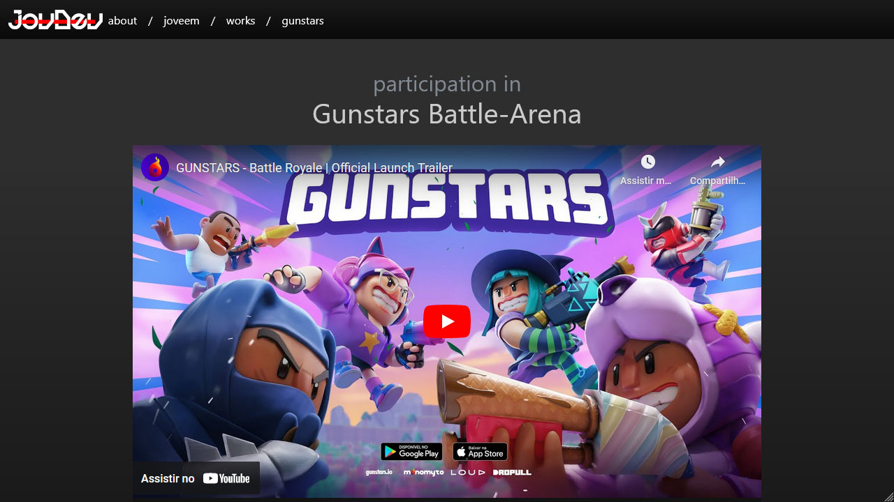
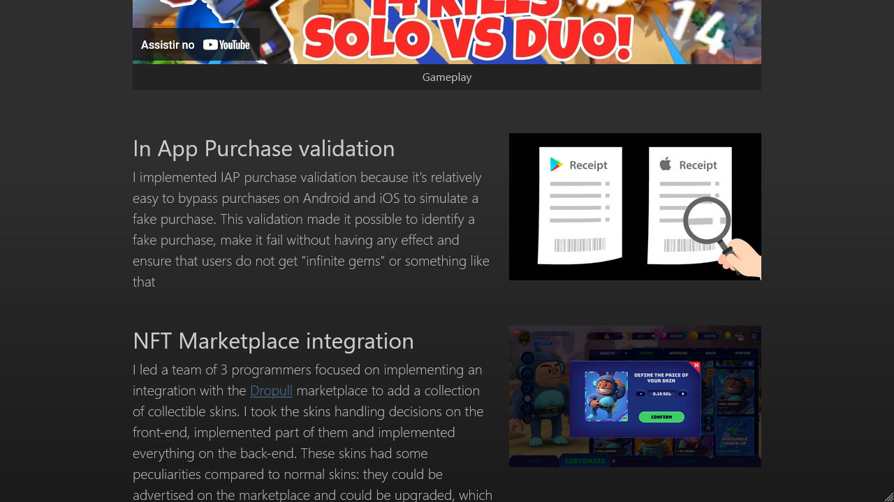


---

### Getting Started:

##### Cloning the repository:

``` 
git clone https://github.com/joveem/first-portfolio-website.git
cd first-portfolio-website
#
```
